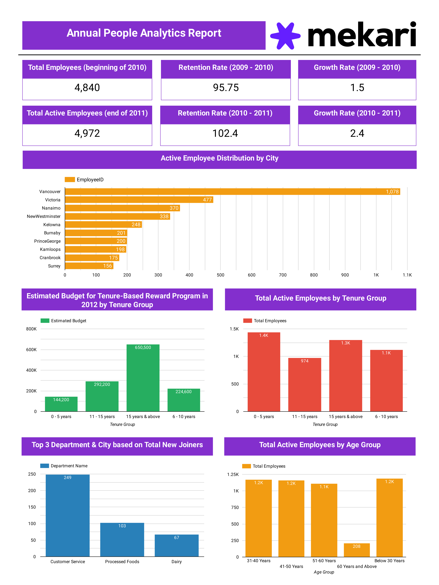

# Annual People Analytics Report
At the end of every year, **The Bloom Company** People Analytics Team publishes an Annual People Analytics Report to be distributed to relevant stakeholders & management. For the last two years (since the beginning of 2010 until the end of 2011), **The Bloom Company** has been focusing a lot on improving employee retention and hiring activity.

Some of our objectives were to increase employee retention rate & company growth rate, through initiatives such as allocating budget for new tenure-based reward programs, conducting a more thorough manpower planning based on historical data, as well as ensuring hiring inclusivity in regards to age & gender distributions among employees.

This year (2011), we would like to evaluate whether the efforts have been successful or not. As a People Analytics Associate, you need to make sure that this year’s Annual People Analytics Report provides all the insights needed to answer the questions regarding the success of our previously-launched initiatives.

# SQL Analysis
- [Age Group](SQL/Age-Group.sql)
- [Growth Rate](SQL/Growth-Rate.sql)
- [Retention Rate](SQL/Retention-Rate.sql)
- [Tenure](SQL/Tenure.sql)
- [Top 3 Department and City](SQL/Top-3-Department-and-City.sql)

# Data Visualization
